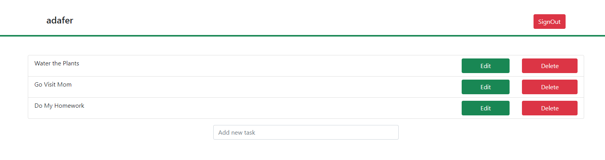

# ToDo App - React.

This app will let you log in and create new tasks on your account.
Besides that, you can also Edit existing tasks and Delete them.
At the moment creating new users is not possible (this app is currently in development).

### Built With

- JS
- React
- Axios,
- npm,
- CSS,
- JSX,
- universal-cookie,
- Bootstrap.

### Set Up.

This app uses an API that has been created already, go to this [link](https://github.com/balerum03/tasks-users-API), follow the setup instruction there and then come back to continue with these Setup steps for this app.

after following the steps for the API, follow these steps:
- Open your terminal and clone this repo by typing `git clone https://github.com/balerum03/todo-app-react.git`
- Then run `npm install`
- To start the app run `npm start`
- after running `npm start` your default browser will open and you can start using the app.

## Author

👤 **Adan Fernandez B.**

- Github: [@balerum03](https://github.com/balerum03)
- Twitter: [@balerum03](https://twitter.com/balerum03)
- Linkedin: [Adan Fernandez B.](https://www.linkedin.com/in/adan-fernandez-bonilla)

## 🤝 Contributing

Contributions, issues and feature requests are welcome!

Feel free to check the [issues page](issues/).

## Show your support

Give a ⭐️ if you like this project!